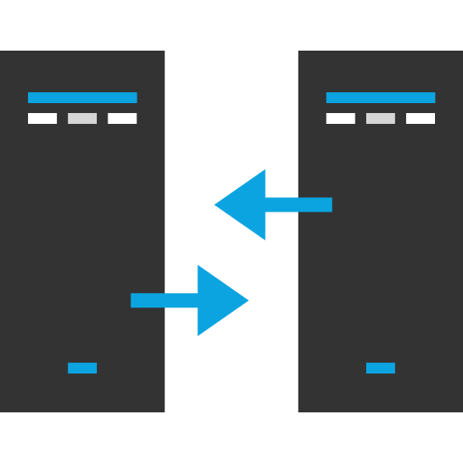

# {{ $frontmatter.title }}

<p align="center">
    
</p>

## Gateway Setup
Central component in the architecture, controlling all the traffic, connecting to internet and acting as DNS, DCHP, NTP and firewall server. Cluster is accessed using gateway as a jump server.

### Gateway node
* **`berryX`** : RaspberryPi 4B, 8GB

## :cd: OS deployment
The gateway node runs on the latest Ubuntu 25.10 server. The process for setting up your OS on Raspebbry Pi can be done in following steps.

1. Download and install microSD Imager: [Raspberry Pi Imager](https://ubuntu.com/download/raspberry-pi)

2. Flash the MicroSD card with desired OS type and version

3. Update cloud-init config files: `user-data` and `network-config` 


## :gear: Cloud-init configuration

Using standard YAML formatted file for all nodes to setup default access point and network settings.

Replace all content of `user-data`

```yaml
#cloud-config

# System Configuration
timezone: Europe/London
locale: en_GB.UTF-8
hostname: berry01
manage_etc_hosts: localhost

# User Account Configuration
users:
- name: berryadmin
  primary_group: users
  groups: adm, sudo
  shell: /bin/bash
  lock_passwd: true
  ssh_authorized_keys:
    - ssh-ed25519 AAAAC3NzaC....TEMPLATE #Replace with your public key
  sudo: ALL=(ALL) NOPASSWD:ALL


# System Updates
package_update: true
package_upgrade: true

# Essential Packages
packages:
  - curl
  - wget
  - git

# Inherited security settings
ssh_pwauth: false
disable_root: true

# Reboot after configuration
power_state:
  mode: reboot
```

Replace all content of `network-config`

```yaml
# Cloud-init network configuration
network:
  version: 2
  renderer: networkd

  ethernets:
    eth0:
      dhcp4: false
      addresses:
        - 10.0.0.1/24

  wifis:
    wlan0:
      dhcp4: false
      optional: true
      access-points:
        "YourWiFiSSID":
          password: "YourWiFiPassword"
        "YourWiFiSSID":
          password: "YourWiFiPassword"
      addresses:
        - 192.168.1.10/24
      routes:
        - to: default
          via: 192.168.1.1
      nameservers:
        addresses:
          - 1.1.1.1
          - 8.8.8.8
          - 8.8.4.4
```

### After initial cloud-init bootup

```bash
# Run package update
sudo apt update && sudo apt full-upgrade -y
```

```bash
# Network packages
sudo apt install -y \
    dnsmasq \
    net-tools \
    haproxy

#system packages
sudo apt install -y \
    curl \
    git \
    wget 
```

## :globe_with_meridians: Network configuration
The network is segregated in 2 parts
* **Home Network Endpoint:** 192.168.1.10/24 Wifi connection to home internet router
* **Cluster Network Endpoint:** 10.0.0.1 cable setup into LAN switch

## :globe_with_meridians: DNS & DHCP configuration

### dnsmasq configuration

dnsmaq is a lightweight DNS, DHCP service that is suitable for smaller network and home lab setup. The setup include Static IP management and DNS forwarding.

```bash
# 1. Ensure dnsmasq is installed and enabled
apt list --installed | grep dnsmasq
sudo systemctl status dnsmasq

#2. Backup default config
sudo cp /etc/dnsmasq.conf /etc/bak_dnsmasq.conf

#3 Create config location .d if one does not yet exist
sudo mkdir /etc/dnsmasq.d/

#4. Uncomment dnsmasq.conf setting that enables conf file directory lookup
sudo sed -i 's|#conf-dir=/etc/dnsmasq\.d/,\*\.conf|conf-dir=/etc/dnsmasq.d/,*.conf|' /etc/dnsmasq.conf


```

### LAN config: `/etc/dnsmasq./10-lan.conf`

```bash
# -----------------------
# DNSMASQ CONFIG FOR LAN
# -----------------------

# Listen only on LAN interface
interface=eth0                                  # DNS and DCHP listening interface
except-interface=lo                             # exclude local loopback
bind-interfaces                                 # ownership of port 53, avoidance of conflict with other DNS resolvers

# DNS security settings
no-resolv                                       # ignore /etc/resolv.conf
bogus-priv                                      # blocks reverse lookup responses for private IP range
stop-dns-rebind                                 # prevents DNS rebind attacks
rebind-localhost-ok                             # allow localhost rebinding

# DNS performance settings
cache-size=500                                  # recommended for small networks 500-2k

# DHCP range on LAN
dhcp-range=10.0.0.20,10.0.0.200,24h             #

# DHCP options
dhcp-option=option:router,10.0.0.1              # router gateway (3)
dhcp-option=option:dns-server,10.0.0.1          # DNS server (6)
dhcp-option=option:ntp-server,10.0.0.1          # NTP server (42)

# Local DNS domain configuration
domain=dtikube.techinsights.com
local=/dtikube.techinsights.com/
expand-hosts                                    # automatically append domain= to entries from hosts files. /etc/hosts

#Enable DNS and DCHP logging
log-queries=extra               # Log DNS
log-dhcp                        # Log DHCP

#DNS external servers
server=1.1.1.1                  # Cloudflare primary
server=8.8.8.8                  # Google primary
server=8.8.4.4                  # Google secondary

```

### Static config: `/etc/dnsmasq./10-lan.conf`

```bash
# -----------------------
# DNSMASQ CONFIG FOR Static IP assignments
# -----------------------

#Resered satic IP addresses for master nodes
dhcp-host=d8:3a:dd:e2:85:37,berry01,10.0.0.5,infinite            #1st
dhcp-host=d8:3a:dd:ef:cd:e5,berry02,10.0.0.6,infinite            #2nd

#Reserver static IP address for worker nodes
dhcp-host=d8:3a:dd:e2:81:5c,berryw11,10.0.0.11,infinite          #3rd
dhcp-host=88:a2:9e:29:a0:bb,berryw10,10.0.0.10,infinite          #5th
```

### Config post-checks

```bash
#1. Restart the service to apply the new settings
sudo systemctl restart dnsmasq

#2. Verify the new setup
sudo systemctl status dnsmasq

#3. Test DNS resolution, avoid false positive and force lookup through dnsmasq
nslookup google.com 10.0.0.1

# To make the node pickup new static assigned IP address
# ssh to the node and restart the service
sudo systemctl restart systemd-networkd
```

## Router Configuration
LAN cluster by default cannot reach internet outside its local network area. To enable it gateway is configured to act as a router.

```bash
# Enable packet forwarding
echo "net.ipv4.ip_forward=1" | sudo tee -a /etc/sysctl.conf

# Apply forwarding changes now
sudo sysctl -p

# Verify setup
cat /proc/sys/net/ipv4/ip_forward

```
With forwarding enabled, the traffic might still not reach intended destination. Lets look at firewall setup to ensure that router setup is working.


## :fire: Firewall Configuration
To configure our firewall settings `nftables` will be used as it is more modern and the successor for iptables config. All rules in theory can be defined in `/etc/nftables.conf` for a small and relatively static network setup.

### Check Existing Setup
```bash
# Check nftables is installed. Use "enable" and "start" if not active.
apt list --installed | grep nftables
sudo systemctl status nftables

# Check existing config of nftables
cat /etc/nftables.conf

# Enable nftables start up post server restart
sudo systemctl enable nftables
```

> [!IMPORTANT]
> Configuration references are key sensitive, for simplicity of setup suggestion is to keep it either all CAPS or all lower case.

 The chosen setup features the professional approach of modular structure for nftables configuration, often used in production environments and has improved maintainability and scalability. In addition, the configuration files are numbered to guarantee loading order and provide predictability.

 ### Creating Modular Structure

```bash
# Create main structure
sudo mkdir /etc/nftables.d/
sudo mkdir /etc/nftables.d/60-nat/

# Creating main filtering rulesets and static
sudo nano /etc/nftables.d/10-constants.nft
sudo nano /etc/nftables.d/20-sets.nft
sudo nano /etc/nftables.d/30-input.nft
sudo nano /etc/nftables.d/40-forward.nft
sudo nano /etc/nftables.d/50-output.nft

# Creating NAT rulesets
sudo nano /etc/nftables.d/60-nat/10-prerouting.nft
sudo nano /etc/nftables.d/60-nat/20-postrouting.nft
``` 


### Update `/etc/nftables.conf`

 ```bash
#!/usr/sbin/nft -f
# General Firewall settings
# This config file is updated only once during initial creation

# Clear ruleset before applying new
flush ruleset

# include all modular files
include "/etc/nftables.d/*.nft"
include "/etc/nftables.d/nat/*.nft"
 ``` 

### Create Constants Set `/etc/nftables.d/10-constants.nft`
```bash
# Network Interface Definitions
define lan_if = eth0      # LAN network, listening local
define wan_if = wlan0     # Home network, listening external

# Network Address Ranges
define lan_net = 10.0.0.0/24        # LAN local network
define home_net = 192.168.1.0/24    # Home network
```

### Create Constants Set `/etc/nftables.d/20-sets.nft`
```bash
#Not yet defined
```

### Incoming Traffic Rules `/etc/nftables.d/30-input.nft`
```bash
# Ruleset for incoming traffic

table ip filter {

    chain input {
        # default drop all that does not match our ruleset
        type filter hook input priority 0;
        policy drop;

        # Allow loopback interface for local services
        iif "lo" accept

        # Allow already established connections
        ct state established,related accept

        # Allow LAN access
        iif $lan_if ip saddr 10.0.0.0/24 accept

        # Allow SSH from trusted hosts
        tcp dport 22 ip saddr 192.168.1.111 accept

        # 5. Optional: allow ping from LAN
        icmp type echo-request accept
    }
}
```

### Create Constants Set `/etc/nftables.d/40-forward.nft`
```bash
# Ruleset for packets passing through the router

table ip filter {
    chain forward {
        # default drop all that does not match our ruleset
        type filter hook forward priority 0;
        policy drop;

        # Allow loopback interface for local services
        ct state established,related accept

        # Enable LAN → WAN access to internet services
        iif $lan_if oif $wan_if accept

        # Enable Wan -> LAN access
        iif $wan_if oif $lan_if accept

        # Logging with custom string to help with high level analysis and limiting log input to not flood the logs
        log prefix "[GATEWAY FORWARD DROP]: " limit rate 5/minute burst 5 packets

    }
}
```

### Outgoing traffic Rules `/etc/nftables.d/50-output.nft`
```bash
# Ruleset for filtering outgoing traffic
# Required to initiate package and system updates and communicate with external services

# Configuration does not restrict outgoing traffic
table ip filter {

    chain output {
        type filter hook output priority 0;
        policy accept;
    }
}
```

### Create DNAT Ruleset `/etc/nftables.d/60-nat/10-prerouting.nft`
```bash
# Ruleset for DNAT (destination network address translation) and port forwarding

table ip nat {

    chain prerouting {
        type nat hook prerouting priority -100;

        # Logging with custom string to help with high level analysis and limiting log input to not flood the logs
        log prefix "[NAT PREROUTING]: " limit rate 5/minute burst 5 packets
    }
}

#Example: port forwarding of external port 80 to internal destination
# iifname $wan_if tcp dport 80 dnat 10.0.0.5.80
```

### Create SNAT Ruleset `/etc/nftables.d/60-nat/20-postrouting.nft`
```bash
# Ruleset for SNAT (source network address translation)
# Important enabler for LAN cluster access to internet

table ip nat {

    chain postrouting {
        type nat hook postrouting priority 100;

        # Transform (masquarade) intnerl IPs 10.0.0.x into gteway external 192.168.1.x
        oif $wan_if ip saddr $lan_net masquerade

        # Logging with custom string to help with high level analysis and limiting log input to not flood the logs
        log prefix "[NAT POSTROUTING]: " limit rate 5/minute burst 5 packets
    }
}
```

### Post Checks
```bash
# Check syntax, useful check after config file edit(s)
# Expected output: nothing, unless syntax issue it will throw error details
sudo nft -c -f /etc/nftables.conf

# List all nftables ruleset 
# Note that all constants will be replaced with actual values
sudo nft list ruleset

# List NAT ruleset
sudo nft list table nat

# Network traffic check from LAN node
ping -c 3 192.168.1.1   #Home internet router IP
ping -c 3 8.8.8.8       # External IP

# check if specific ports are open. Example: ftp, SSH, domain, http, https
nmap -p 21,22,53,80,443 10.0.0.1

#check all ports in range 1-1000
nmap -p 1-1000 10.0.0.1

# Check firewall logs

```


## :clock3: NTP/NTS Configuration

Gateway server is positioned to provide Network Time Protocol services using `chrony`, allowing seamless time accuracy across the cluster. 

::: info Why **`chrony`**? 
* Moder, fast and high accuracy NTP service
* Can safely handle large de-sync gaps
* Included as default on many newer version Linux distros, replacement of older version `ntpd`
* Is recommended for orchestrated environment like Kubernetes
* Very low CPU and network resource consumption
:::

### Check Existing Setup

```bash
# Check chrony is installed
apt list --installed | grep chrony

# Check current setup
cat /etc/chrony/chrony.conf

# Check current status, Use enable and start to activate.
sudo systemctl status chrony

```

### Create Server Structure
```bash
# Create config file for server side
sudo nano /etc/chrony/conf.d/ntp-server.conf
```

### Server Configuration `/etc/chrony/conf.d/ntp-server.conf`

```bash
# Allow LAN clients to use this router as NTP server
allow 10.0.0.0/24

# Let router serve time even if internet goes down
local stratum 10

# Optional: Let LAN clients run readonly chronyc commands
cmdallow 10.0.0.0/24
```

### Server Source Configuration `/etc/chrony/sources.d/ubuntu-ntp-pools.sources`
Remains unchanged from original installed configuration version.
```bash
# Use NTS by default
# NTS uses an additional port to negotiate security: 4460/tcp
# The normal NTP port remains in use: 123/udp
pool 1.ntp.ubuntu.com iburst maxsources 1 nts prefer
pool 2.ntp.ubuntu.com iburst maxsources 1 nts prefer
pool 3.ntp.ubuntu.com iburst maxsources 1 nts prefer
pool 4.ntp.ubuntu.com iburst maxsources 1 nts prefer
# The bootstrap server is needed by systems without a hardware clock, or a very
# large initial clock offset. The specified certificate set is defined in
# /etc/chrony/conf.d/ubuntu-nts.conf.
pool ntp-bootstrap.ubuntu.com iburst maxsources 1 nts certset 1
```

### Test NTP/NTS Setup
```bash
# Restart chrony to load the new config
sudo systemctl restart chrony

# Check connection details
chronyc -n sources
# Look for an output starting with ^* (source we are using)

# View chrony activity
chronyc activity

# Check NTP clients connected to our server
sudo chronyc clients
#should see IP addresses from our local LAN 

```
