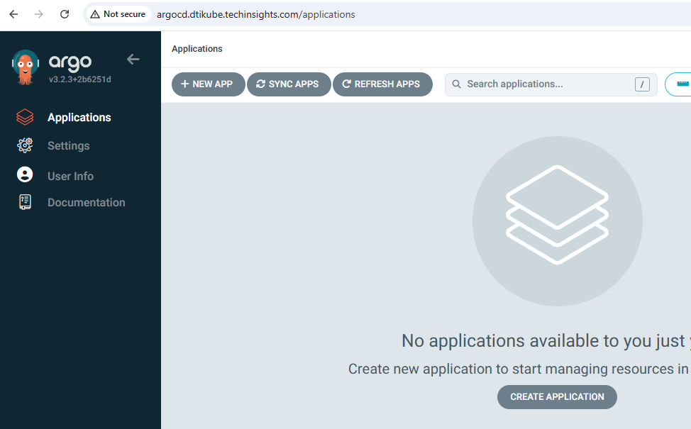

# {{ $frontmatter.title }}

<p align="center">
    
</p>


**GitOps** a model where Git is perceived as a single source of truth for the infrastructure and applications. Declare what should run, Git commit, and automated controllers ensure the cluster continuously matches that state. 
Approach provides versioning, audits, rollbacks, and safer deployments through pull requests rather than manual cluster changes.

**Argo CD** is a GitOps controller for Kubernetes that watches Git repositories and reconciles them with the cluster state. It deploys applications, detects drift, self-heals when resources change outside Git, and provides UI/CLI for visibility. 
Deployment and Sync Capabilities:
* Helm 
* Kustomize
* plain manifests
* multi-cluster setups
* automated or manual sync strategies

The DTIKube cluster together with ArgoCD and Git provide a compact and yet robust production-grade environment, making it reproducible, secure and low maintenance overhead.

## Deploying ArgoCD

### Preparing Environment
Creating namespace, adding helm repo and providing initial config yaml.np
```bash
# Create namespace 
kubectl create namespace argocd

# Add ArgoCD helm chart 
helm repo add argo https://argoproj.github.io/argo-helm

# Update helm repo (fetch latest)
helm repo update
```
### Config values
Since no active project is yet running, test values are provided enabling setup sanity testing.
```bash
configs:
  params:
    server.insecure: true
    application.namespaces: "*"

  cm:
    timeout.reconciliation: 180s

  rbac:
    policy.default: role:admin

server:
  ingress:
    enabled: true
    ingressClassName: traefik
    hostname: argocd.dtikube.techinsights.com
    hosts:
      - argocd.dtikube.techinsights.com

applicationSet:
  enabled: true
  replicas: 1

dex:
  enabled: false

redis:
  enabled: true

notifications:
  enabled: false

metrics:
  enabled: false
```

### Deployment

```bash
# Deploying AgroCD in agrocd namespace
helm install argo argo/argo-cd \
  -n argocd \
  -f argocd-values.yaml
```

### Validation
Validation after initial deployment is done.
```bash
# Check pods
kubectl get pods -n argocd

# Check secrets
kubectl get secret -n argocd

# Obtain Secret for UI login (admin)
kubectl get secret argocd-initial-admin-secret -n argocd \
  -o jsonpath="{.data.password}" | base64 -d

# Useful summary check post deployment
kubectl get deploy,svc,ingress argo-cd \
  -o wide \
  -n argocd
```

To access the ArgoCD URL from the control node one additional configuration is required on the windows laptop in path: `C:\Windows\System32\drivers\etc\hosts`
Open the hosts file in admin mode and add new line:
```
<Cluster-node-IP> grafana.dtikube.techinsights.com
```

This will redirect browser session to our cluster and `traefik` ingress will look to match the HTTP call with the rule that was setup earlier. 
Basic setup is now complete.

<p align="center">
    
</p>

## From Git Repo to Cluster
There are various ways to deploy applications in the Kubernetes cluster utilising ArgoCD. Natively ArgoCD provides CLI and UI allowing for easier management of deployments.

DTIKube cluster will utilise:
* Plain directory based application deployment
* App of apps based deployment

### Directory Based Deployment
This type of deployment uses manifest files from a specific directory within a Git repository with filetype (.yml, .yaml, and .json). It is easy to apply and will serve as initial setup for the first apps.

#### Setup 
The application artefacts stored in the Git repository and the setup outlines both directory structure and manifest examples with detailed description.

**Example Structure:**
```
repo/
└── apps/
    └── directory-app/
        ├── deployment.yaml
        ├── service.yaml
        ├── ingress.yaml
        └── application.yaml
```

**Example manifests:**

`deployment.yaml`
Defines how the application Pods are created, updated, and scaled.
```bash
apiVersion: apps/v1
kind: Deployment
metadata:
  name: directory-app
  namespace: demo
  labels:
    app.kubernetes.io/name: directory-app
spec:
  replicas: 2
  selector:
    matchLabels:
      app: directory-app
  template:
    metadata:
      labels:
        app: directory-app
    spec:
      containers:
        - name: directory-app
          image: nginx:stable-alpine # sample "hello world"
          ports:
            - containerPort: 80
          resources:
            requests:
              cpu: 100m
              memory: 128Mi
            limits:
              cpu: 500m
              memory: 256Mi
```
**Config Info:**
* **`metadata.name`** Name of the deployment.
* **`metadata.namespace`** Namespace where deployment is created.
* **`metadata.labels`** Standard Kubernetes recommended label.
* **`spec.selector.matchLabels.app`** Label selector to match Pods managed by this Deployment.
* **`spec.template.metadata.labels.app`** Labels applied to Pods (must match selector).
* **`spec.template.spec.containers.name`** Name of the container.
* **`spec.template.spec.containers.image`** Target image that is used in deployment.
* **`spec.template.spec.ports.containerPort`** Port exposed by the container.
* **`spec.template.spec.resource.requests`** Assign resource limits for the given container.


`service.yaml`
Provides a stable network endpoint to access the application Pods.
```bash
apiVersion: v1
kind: Service
metadata:
  name: directory-app
  namespace: demo
spec:
  selector:
    app: directory-app
  ports:
    - name: http
      port: 80
      targetPort: 80
```
**Config Info:**
* **`metadata.name`** Name of the service.
* **`metadata.namespace`** Namespace where Service is created.
* **`spec.selector.app.`** Services the Pods with label app=directory-app.
* **`spec.ports.port.`** Port exposed by the Service.
* **`spec.ports.targetPort.`** Port that the container traffic is forwarded to.


`ingress.yaml`
Exposes the application to external users via HTTP/HTTPS.
```bash
apiVersion: networking.k8s.io/v1
kind: Ingress
metadata:
  name: directory-app
  namespace: demo
  annotations:
    traefik.ingress.kubernetes.io/router.entrypoints: web
spec:
  ingressClassName: traefik
  rules:
    - host: directory-app.dtikube.techinsights.com
      http:
        paths:
          - path: /
            pathType: Prefix
            backend:
              service:
                name: directory-app
                port:
                  number: 80
```
**Config Info:**
* **`metadata.name`** Name of the ingress.
* **`metadata.namespace`** Namespace where the Ingress is created.
* **`metadata.annotations`** Entry point to Ingress
* **`spec.ingressClassName`** Choice of ingress controller (Match your cluster setup).
* **`spec.rules.host`** DNS host for routing traffic.
* **`spec.rules.http.paths.path`** URL path to match.
* **`spec.rules.http.paths.pathType`** Match all paths with this prefix.
* **`spec.rules.http.paths.backend`** Backend service details name and port.

`application.yaml`
Argo CD instruction how to deploy and manage the application using GitOps.
```bash
apiVersion: argoproj.io/v1alpha1
kind: Application
metadata:
  name: directory-app
  namespace: argocd
spec:
  project: default
  source:
    repoURL: https://github.com/didzisdti/sandbox
    targetRevision: main
    path: apps/directory-app
  destination:
    server: https://kubernetes.default.svc
    namespace: demo  
  syncPolicy:
    automated:
      prune: true
      selfHeal: true
```

**Config Info:**
* **`kind`** Declares an Argo CD managed CRD.
* **`metadata.name`** Name of the Argo CD Application.
* **`metadata.namespace`** Namespace where Argo CD is installed.
* **`spec.source.repoURL`** Your target Git repository containing the application.
* **`spec.source.path`** Directory in the Git repository.
* **`spec.source.targetRevision`** Specific Git tag, branch, or commit that Argo will trace.
* **`spec.destination.namespace`** Target namespace where the application will be deployed.
* **`spec.destination.server`** Target cluster for deployment. https://kubernetes.default.svc = local cluster.
* **`spec.syncPolicy.automated`** Optional config for automatic synchronization, pruning and self-healing.

#### Bootstrap to Cluster
Use the application.yaml directly from the repository or pull it locally on the cluster.
If using remote one, ensure to specify RAW .yaml file path.

```bash
kubectl apply -f https://raw.githubusercontent.com/didzisdti/sandbox/main/apps/directory-app/application.yaml \
  -n argocd
```

#### Confirm Deployment
The expected outcome of above deployment is a welcome page for NGINX accessible in the control nodes browser, confirming that the deployment was successful.

1. Check ArgoCD URL (Healthy, Synced)
```
http://argocd.dtikube.techinsights.com/
```

2. Check the Pods on Cluster are running
```bash
kubectl get pods -n demo
```

3. Check Ingress is set
```bash
kubectl get ingress -n demo
```

4. Set URL mapping in Windows 
```
C:\Windows\System32\drivers\etc\hosts
```

5. Open URL in your browser and view the welcome page. 

### App of Apps Deployment


## Config Removal
Should the need arise to remove argocd setup or re-create it from scratch followings steps should be applied.

```bash
# Remove Argo CD from the cluster
helm uninstall argo -n argocd

# Remove any app installed
kubectl delete application <app-name> -n <namespace>

# Remove CRD's created during setup
kubectl delete crd applications.argoproj.io applicationsets.argoproj.io appprojects.argoproj.io

# Remove namespace (ensures all CRD's secrets, etc. are removed)
kubetl delete namespace argocd
```
**Check setup is removed:**
```bash
kubectl get ns argocd
kubectl get crd | grep argoproj
kubectl get applications -A
kubectl get applicationsets -A
```


### Secure GitOps

TO DO in next phase!

